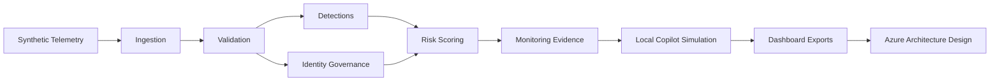

# Azure Enterprise Security Intelligence Platform

A production-style Azure security analytics and AI platform that simulates enterprise telemetry
ingestion, identity governance, threat detection, security posture monitoring, compliance evidence,
dashboard reporting, and local GenAI-style security investigation workflows.

## Overview

The Azure Enterprise Security Intelligence Platform is a local-first portfolio project for
enterprise security analytics and cloud security architecture. It uses deterministic synthetic data
to model how security telemetry could move through ingestion, validation, detection engineering,
identity governance, risk scoring, operational evidence, dashboard exports, and future
AI-assisted investigation workflows.

The project is intentionally safe to run locally. It does not connect to Azure, does not deploy
cloud resources, does not use real users or credentials, and does not call Azure OpenAI, Azure AI
Foundry, OpenAI, Microsoft Graph, Defender XDR, Sentinel, or Power BI APIs.

## Architecture Overview



The local architecture mirrors production security analytics patterns while keeping every step
transparent, testable, and reproducible.

## Business Problem

Enterprise security teams often operate across disconnected tools, fragmented telemetry, duplicated
alerts, weak identity governance, and slow investigation workflows. Compliance evidence and
executive reporting can require manual collection from several systems. AI-assisted investigation
can help, but it needs clean telemetry, traceable evidence, governed identity signals, and a clear
operating model first.

This project demonstrates that foundation using a local implementation mapped to Microsoft security
and Azure architecture concepts.

## Target Users

- SOC analysts and SOC analytics engineers
- Security engineers and cloud security engineers
- Identity engineers and Zero Trust governance teams
- Security architects and cybersecurity leaders
- Security data scientists and AI engineers
- Risk, compliance, and executive reporting teams

## Key Capabilities

- Deterministic synthetic security telemetry generation
- Raw JSONL ingestion into processed CSV datasets
- Data quality validation and evidence reporting
- Deterministic threat detection rules with MITRE ATT&CK mapping
- Identity governance checks for MFA gaps, guest exposure, privileged access, and role sprawl
- Explainable entity risk scoring
- Operational health monitoring and evidence manifest generation
- Local simulated GenAI-style investigation summaries and remediation plans
- Dashboard-ready CSV exports for Power BI, Streamlit, and reporting workflows
- Azure architecture and deployment design documentation with safe IaC skeletons
- Pytest and Ruff quality gates

## Azure Service Mapping

| Platform area | Azure alignment | Purpose |
| --- | --- | --- |
| Telemetry ingestion | Microsoft Sentinel, Azure Monitor, Event Hub, Log Analytics | Collect and normalise security events. |
| Identity governance | Microsoft Entra ID, Entra ID Governance, Conditional Access, PIM | Support Zero Trust access review and privileged access governance. |
| Endpoint and cloud security | Microsoft Defender XDR, Defender for Endpoint, Defender for Cloud | Model endpoint, incident, and cloud posture signals. |
| Data and analytics | Azure Data Lake Storage, Azure Data Explorer, Microsoft Fabric, Power BI | Store, query, and report on security intelligence datasets. |
| Risk scoring | Azure Data Explorer, Azure Machine Learning | Provide explainable scoring today and future ML-readiness. |
| Investigation assistance | Azure AI Foundry, Azure OpenAI, Azure AI Search | Represent future governed investigation and RAG workflows locally. |
| Governance and secrets | Azure Key Vault, Managed Identity, RBAC, Azure Policy, Microsoft Purview | Map to secure production controls without storing secrets locally. |
| Monitoring and reporting | Azure Monitor, Application Insights, Sentinel workbooks, Power BI | Support operational visibility and executive reporting. |

## Local-First Implementation Note

This repository is a local simulation and architecture design project. It uses artificial telemetry
and local outputs only. Infrastructure files under `infra/` are reference skeletons for portfolio
documentation and must not be treated as production-ready deployment templates.

## End-To-End Workflow

1. Generate synthetic telemetry in `data/raw/`.
2. Ingest raw JSONL files into processed CSV files in `data/processed/`.
3. Validate processed datasets and produce data quality evidence.
4. Run deterministic threat detections.
5. Run identity governance checks.
6. Score users, devices, and resources by risk.
7. Generate operational health and evidence artifacts.
8. Generate local simulated GenAI-style investigation briefs.
9. Export dashboard-ready CSV datasets.
10. Review Azure production architecture and deployment design artifacts.

## Quickstart

```bash
python3 -m venv .venv
source .venv/bin/activate
python -m pip install -e ".[dev]"

python -m pytest
python -m ruff check .
python -m security_intelligence.cli health-check
```

Run the full local workflow:

```bash
bash scripts/run_all_local.sh
```

For a step-by-step demo, see [LOCAL_DEMO.md](LOCAL_DEMO.md).

## CLI Command Reference

| Command | Purpose |
| --- | --- |
| `health-check` | Confirm the local scaffold is ready. |
| `show-config` | Print parsed platform configuration. |
| `generate-telemetry` | Generate synthetic JSONL telemetry. |
| `ingest-telemetry` | Convert raw JSONL telemetry into processed CSV datasets. |
| `validate-telemetry` | Validate processed telemetry and generate quality evidence. |
| `run-detections` | Run deterministic threat detection rules. |
| `run-identity-checks` | Run identity governance analytics. |
| `score-risk` | Generate explainable entity risk scores. |
| `monitor-platform` | Generate operational health and evidence outputs. |
| `generate-copilot-briefs` | Generate local simulated GenAI-style investigation reports. |
| `export-dashboard-data` | Export dashboard-ready CSV datasets and summary metadata. |

Full details are documented in [docs/cli_reference.md](docs/cli_reference.md).

## Generated Outputs

Major output groups include:

- `data/raw/*.jsonl`: synthetic raw telemetry
- `data/processed/*.csv`: processed telemetry datasets
- `outputs/*.json`: ingestion, validation, findings, risk, monitoring, evidence, and copilot context
- `outputs/*.csv`: identity review and risk scoring tables
- `reports/*.md`: human-readable evidence, findings, governance, risk, operational, and copilot reports
- `dashboards/exports/*.csv`: dashboard-ready exports
- `dashboards/dashboard_summary.json`: dashboard export summary

See [docs/output_catalog.md](docs/output_catalog.md) for the complete output catalog.

## Dashboard Exports

Milestone 10 produces dashboard-ready CSV files for Power BI import, Streamlit prototyping,
spreadsheet review, SOC reporting, governance dashboards, and executive reporting:

- `dashboards/exports/security_findings_dashboard.csv`
- `dashboards/exports/identity_governance_dashboard.csv`
- `dashboards/exports/risk_scores_dashboard.csv`
- `dashboards/exports/operational_health_dashboard.csv`
- `dashboards/exports/executive_summary_metrics.csv`
- `dashboards/exports/evidence_manifest_dashboard.csv`

The optional [dashboards/streamlit_app.py](dashboards/streamlit_app.py) reads these exports when
Streamlit is installed, but Streamlit is not required for tests.

## Copilot Simulation Outputs

The local copilot layer simulates Azure AI Foundry or Security Copilot-style workflows without
calling any external service. It produces:

- `outputs/copilot_context.json`
- `reports/copilot_investigation_summary.md`
- `reports/copilot_soc_triage_note.md`
- `reports/copilot_executive_brief.md`
- `reports/copilot_remediation_plan.md`
- `reports/copilot_compliance_evidence_summary.md`

Every generated report states that it is a local simulated GenAI-style response based on synthetic
platform outputs.

## Architecture And Deployment Design

Production mapping and deployment planning artifacts:

- [infra/README.md](infra/README.md)
- [infra/azure_architecture.md](infra/azure_architecture.md)
- [infra/deployment_plan.md](infra/deployment_plan.md)
- [infra/security_controls.md](infra/security_controls.md)
- [infra/cost_considerations.md](infra/cost_considerations.md)
- [infra/environments.md](infra/environments.md)
- [docs/architecture.md](docs/architecture.md)
- [docs/production_architecture.md](docs/production_architecture.md)
- [docs/security_operations_model.md](docs/security_operations_model.md)
- [diagrams/azure_architecture.mmd](diagrams/azure_architecture.mmd)
- [diagrams/data_flow.mmd](diagrams/data_flow.mmd)
- [diagrams/security_operations_flow.mmd](diagrams/security_operations_flow.mmd)

## Repository Structure

```text
configs/                  Platform, detection, and compliance configuration
data/                     Raw, processed, and sample local data folders
dashboards/               Dashboard exports, summary, and optional Streamlit placeholder
diagrams/                 Mermaid architecture and operations diagrams
docs/                     Architecture, operations, CLI, outputs, testing, and limitations docs
infra/                    Azure reference architecture and safe IaC skeletons
notebooks/                Reserved for future local exploration
outputs/                  Machine-readable pipeline outputs
reports/                  Human-readable Markdown reports
scripts/                  Local verification scripts
src/security_intelligence/ Python package and CLI implementation
tests/                    Pytest coverage by platform layer
```

## Testing And Quality Checks

```bash
python -m pytest
python -m ruff check .
```

The test suite uses deterministic synthetic data and local temporary directories. It does not require
Azure CLI, Terraform, Bicep CLI, cloud credentials, paid services, or network access.

See [docs/testing_strategy.md](docs/testing_strategy.md) for testing details.

## Portfolio Positioning

This project demonstrates security data engineering, detection engineering, identity governance
analytics, Zero Trust thinking, deterministic risk scoring, operational evidence generation,
dashboard-ready reporting, local GenAI-style investigation workflows, Azure architecture mapping,
infrastructure-as-code design awareness, and quality automation.

It is aligned to roles involving cloud security engineering, SOC analytics engineering,
cybersecurity architecture, security data science, AI engineering, and data/ML engineering in
regulated environments.

See [PROJECT_WALKTHROUGH.md](PROJECT_WALKTHROUGH.md) and
[PORTFOLIO_SUMMARY.md](PORTFOLIO_SUMMARY.md) for a concise project narrative.

## Milestone Status

| Milestone | Name | Status |
| --- | --- | --- |
| 1 | Scaffold | Complete |
| 2 | Synthetic telemetry | Complete |
| 3 | Ingestion pipeline | Complete |
| 4 | Validation and data quality | Complete |
| 5 | Threat detection rules | Complete |
| 6 | Identity governance checks | Complete |
| 7 | Risk scoring and analytics | Complete |
| 8 | Monitoring and operational evidence | Complete |
| 9 | GenAI security investigation copilot | Complete |
| 10 | Dashboard and reporting exports | Complete |
| 11 | Azure architecture and deployment design | Complete |
| 12 | Portfolio polish | Complete |

## Limitations And Future Work

The platform uses synthetic data only, has no live Azure deployment, does not include real Sentinel,
Microsoft Graph, Defender XDR, or Power BI integrations, and uses deterministic scoring rather than
trained ML. The copilot layer is a local simulation, and the Terraform/Bicep files are reference
skeletons only.

Future work is documented in [docs/limitations_and_future_work.md](docs/limitations_and_future_work.md).

